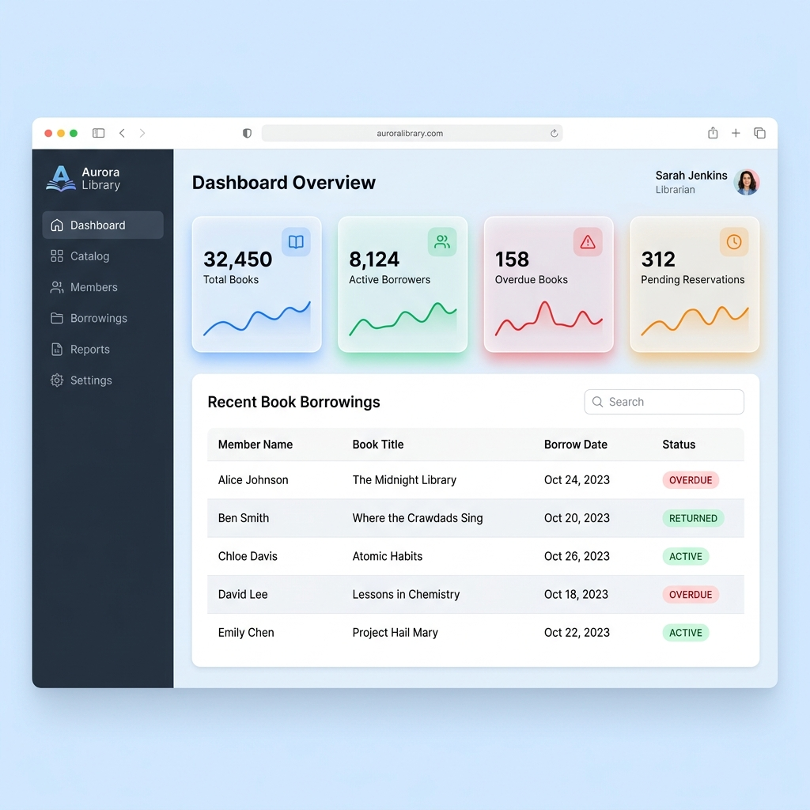

# 🌌 Aurora Library Management System

Aurora Library is a premium, full-stack library management application designed for modern library operations. It features a robust **Spring Boot** backend, a dynamic **React + Vite** frontend, and a high-performance **MongoDB** database. It provides comprehensive tools for cataloging, member management, real-time borrowings, reservation systems, and interactive reports.

---

## 📸 Screenshots

### 🖥️ Dashboard Overview


### 🔑 Portal Login Page


---

## 🚀 Key Features

* **Interactive Dashboard**: Real-time stats on total books, active borrowers, overdue books, and pending reservations.
* **Authentication & Role-Based Access Control (RBAC)**: Secure user registrations and login with JWT and custom access roles (`USER`, `LIBRARIAN`, `ADMIN`).
* **Catalog Management**: Search, sort, view detail page, and manage books.
* **Borrowings & Reservations**: Streamlined workflow for checking out books, tracking return dates, flagging overdues, and reserving books.
* **Member Profiles**: Profile management showing borrowing history, active borrowings, and current reservations.
* **Reporting & Audits**: Summary metrics, recent transactions, and report generation tools.
* **Database Seed Scripts**: Automated shell scripts to populate dummy library books and members data.

---

## 🛠️ Tech Stack

### Backend
* **Language**: Java 17
* **Framework**: Spring Boot 3.x
* **Security**: Spring Security with JWT (JSON Web Tokens) & Password Encoding
* **Database Driver**: Spring Data MongoDB

### Frontend
* **Core**: React 18, ES6+ Javascript
* **Build Tool**: Vite (supporting fast HMR)
* **Styling**: Modern CSS with smooth transitions and glassmorphism styling
* **Routing & Client**: React Router DOM, Axios

### Database
* **Engine**: MongoDB
* **Shell**: Mongosh script for seed injection

---

## 📂 Project Structure

```text
library/
├── backend/                  # Spring Boot Backend Project
│   ├── src/main/java/        # Java Source Files
│   ├── src/main/resources/   # Application properties and settings
│   └── pom.xml               # Maven Dependencies & Configuration
├── database/                 # Database seed scripts & documentation
│   ├── seed/                 # JSON seed data and mongosh runner
│   └── README.md             # DB installation guidelines
├── frontend/                 # Vite + React Frontend Project
│   ├── public/               # Static Assets
│   ├── src/                  # React Source Code (components, views, styles)
│   ├── vite.config.mts       # Vite compiler configuration
│   └── package.json          # Node dependencies
├── screenshots/              # UI Screen mockups (Dashboard & Login)
├── run.sh                    # Unified startup script (runs DB check + dev servers)
└── .gitignore                # Git ignore configuration
```

---

## 🔧 Installation & Setup

### Prerequisites
Make sure you have the following installed on your system:
* **Java SDK 17 or higher**
* **Node.js (v18+) & npm**
* **MongoDB (Community Server)** (must be running as a service)

### 1. Database Initialization
Ensure MongoDB is running, then populate seed library data:
```bash
cd database/seed
mongosh seed-books.mongosh.js
```

### 2. Run the Application Using the Startup Script
Aurora Library includes a unified bash script `run.sh` in the root directory that automatically checks if MongoDB is running and starts both servers in the background.

To launch the system:
1. Make sure you are in the root directory:
   ```bash
   cd /home/Vaibhav/Projects/library
   ```
2. Grant execution permissions (if needed):
   ```bash
   chmod +x run.sh
   ```
3. Execute the script:
   ```bash
   ./run.sh
   ```

The script will launch:
* **Backend API**: `http://localhost:8080` (logs piped to `backend/backend.log`)
* **Frontend Web App**: `http://localhost:5173` (logs piped to `frontend/frontend.log`)

*Press `Ctrl+C` in the terminal to stop both servers gracefully.*

---

## 🔒 Security & API Endpoints

The API is protected with **JWT (Bearer Tokens)**. Obtain your token through the login endpoint and include it in the `Authorization` header: `Authorization: Bearer <your-token>`.

### Authentication Endpoints
* `POST /api/auth/register` - Create a new user account.
* `POST /api/auth/login` - Obtain authorization token.

### Books & Admin Endpoints
* `GET /api/books` - Retrieve all books (with search/filter query support).
* `GET /api/books/{id}` - Get detailed information about a book.
* `POST /api/admin/books` - Add a new book (Admin only).
* `DELETE /api/admin/books/{id}` - Delete a book (Admin only).
* `GET /api/admin/users` - List all registered library members (Admin only).

---

## 🛠️ Troubleshooting

### Frontend Server Fails to Start (npm command not found)
If the frontend fails to run because `npm` is not in your environment's `PATH` but Node.js is installed, you can enable local user shims by running:
```bash
corepack enable npm --install-directory ~/.local/bin
```
Make sure `~/.local/bin` is in your shell's `PATH`.

